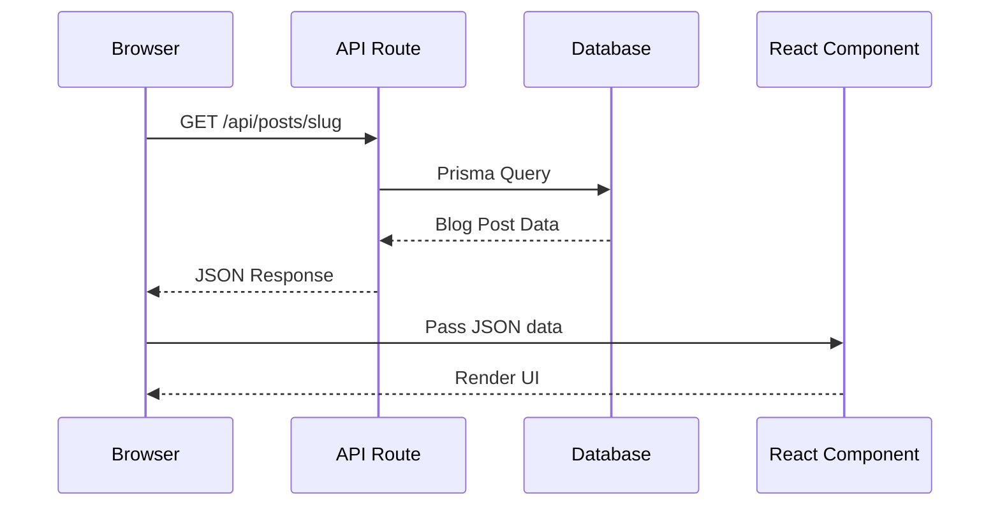
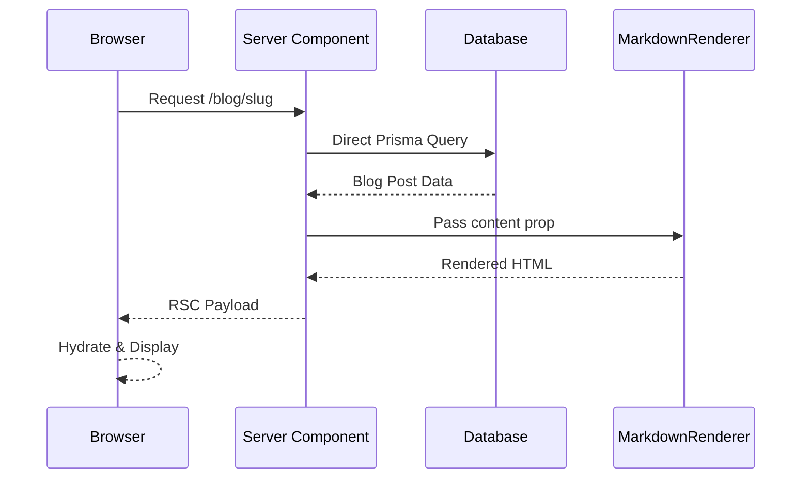

# Understanding Data Flow: Seed → Database → Server Component → Markdown Renderer

## Overview

This document explains how data flows through your Next.js application, from database seeding to rendering markdown content, and why Server Components eliminate the need for API routes.

## Data Flow Diagram

```mermaid
flowchart TD
    A[seed.ts] -->|Creates blog posts| B[(PostgreSQL Database)]
    B -->|Stores markdown content| C[BlogPost Table]
    D[User visits /blog/slug] -->|Triggers| E[Server Component<br/>app/blog/[slug]/page.tsx]
    E -->|Direct Prisma query| B
    B -->|Returns blog post data| E
    E -->|Passes content prop| F[MarkdownRenderer Component]
    F -->|Converts markdown| G[Rendered HTML]
    E -->|Sends RSC payload| H[Browser]
    H -->|Displays| I[User sees formatted blog post]
    
    style A fill:#e1f5ff
    style B fill:#fff4e1
    style E fill:#e8f5e9
    style F fill:#f3e5f5
    style H fill:#fce4ec
```

## The Connection Between Files

### 1. **`prisma/seed.ts`** - Data Initialization

**Purpose**: Populates your database with initial blog post data

**When it runs**: Once when you run `npx prisma db seed` or `npm run prisma:seed`

**What it does**: Creates blog posts with markdown content in the `BlogPost` table

**Example**:
```typescript
{
  slug: 'what-is-tailwindcss',
  title: 'What Is Tailwind CSS?',
  content: `# What Is Tailwind CSS?
Tailwind CSS is a utility-first CSS framework...`
}
```

**Connection**: Provides the data that will later be displayed by your components.

---

### 2. **`app/blog/[slug]/page.tsx`** - Server Component (The Bridge)

**Purpose**: Fetches data and renders the page

**Key feature**: It's a **Server Component** (runs on server, not client)

**What it does**:
```typescript
const posts = await prisma.blogPost.findUnique({
  where: { slug },
});
```

- Directly queries the database using Prisma
- **No API route needed!**
- Passes the markdown content to `MarkdownRenderer`

**Why it's special**: Server Components can directly access:
- Databases (Prisma)
- File system
- Environment variables
- Any server-side code

---

### 3. **`components/markdown_renderer.tsx`** - Presentation Layer

**Purpose**: Converts markdown text into rendered HTML

**Receives**: The `content` string (markdown) from the blog post

**Outputs**: Styled HTML (headings, lists, paragraphs)

**Example transformation**:
```
Input:  # What Is Tailwind CSS?
Output: <h1 className="text-2xl font-bold">What Is Tailwind CSS?</h1>
```

---

## Why No API Methods?

### Traditional Approach (Pages Router / REST APIs)

```
Browser → API Route (/api/posts/[slug]) → Database → JSON → Browser → React Component
```

**Characteristics**:
- Requires separate API routes
- Extra network round-trip
- More code to maintain
- JSON serialization overhead

### Your Current Approach (App Router with Server Components)

```
Browser → Server Component → Database → RSC Payload → Browser
```

**Characteristics**:
- **Server Components run on the server** - they can directly access databases
- **No API route needed** - the component IS the endpoint
- **More efficient** - one less network hop
- **Type-safe** - Direct Prisma queries with TypeScript

---

## The Complete Flow

### Step-by-Step Process

1. **Initial Setup**: Run `npx prisma db seed`
   - `seed.ts` creates blog posts in database
   - Example: "What Is Tailwind CSS?" with markdown content stored in `BlogPost` table

2. **User Visits**: `/blog/what-is-tailwindcss`
   - Next.js calls `app/blog/[slug]/page.tsx` on the server
   - Server Component is executed (not sent to browser)

3. **Server Component Executes**:
   ```typescript
   const posts = await prisma.blogPost.findUnique({
     where: { slug: "what-is-tailwindcss" }
   });
   ```
   - Direct database query (no API call)
   - Gets the blog post with markdown content
   - This happens on the server, not the client

4. **Component Renders**:
   ```tsx
   <MarkdownRenderer content={posts?.content || ""} />
   ```
   - Passes markdown string to renderer
   - Renderer converts `# Heading` → `<h1>Heading</h1>`
   - All styling applied via Tailwind classes

5. **Response Sent**: RSC payload (not JSON) sent to browser
   - Browser receives serialized component tree
   - React hydrates and displays the page
   - User sees the formatted blog post

---

## Key Differences: API Routes vs Server Components

| Aspect | API Routes | Server Components |
|--------|-----------|-------------------|
| **Location** | `app/api/.../route.ts` | `app/.../page.tsx` |
| **Returns** | JSON/Response | React Components |
| **Use Case** | External APIs, webhooks | Pages, data fetching |
| **Database Access** | Yes (via Prisma) | Yes (via Prisma) |
| **Network Calls** | Separate HTTP request | Direct server execution |
| **Response Format** | JSON | RSC Payload |
| **Type Safety** | Manual typing | Automatic (Prisma) |
| **Code Location** | Separate file | Same file as UI |

---

## When Would You Need API Routes?

You'd create API routes (`app/api/.../route.ts`) for:

- **External integrations**: Webhooks, third-party APIs
- **Public APIs**: For other applications to consume
- **Explicit HTTP methods**: POST, PUT, DELETE operations
- **Client-side fetching**: When you need JSON responses for `fetch()` calls
- **Form submissions**: Server Actions are preferred, but API routes work too

**Example API Route**:
```typescript
// app/api/posts/[slug]/route.ts
export async function GET(request: Request, { params }: { params: { slug: string } }) {
  const post = await prisma.blogPost.findUnique({
    where: { slug: params.slug }
  });
  return Response.json(post); // Returns JSON
}
```

For your blog pages, **Server Components are the perfect choice!**

---

## Architecture Comparison

### Traditional REST API Architecture



### Server Components Architecture (Your App)



---

## Summary

**The Connection**:
- **seed.ts** → Creates data in database
- **Server Component** → Fetches data directly (no API needed)
- **MarkdownRenderer** → Displays the data beautifully

**Key Takeaway**: The "connection" is the data flow: seed creates it, Server Component fetches it, MarkdownRenderer displays it. All happening on the server side, which is why you see RSC payloads instead of JSON!

**Why This Matters**:
- ✅ Simpler code (no API routes needed)
- ✅ Better performance (one less network hop)
- ✅ Type safety (direct Prisma integration)
- ✅ Modern Next.js pattern (App Router best practice)

---

## Related Files

- `prisma/seed.ts` - Database seeding script
- `app/blog/[slug]/page.tsx` - Server Component that fetches and displays blog posts
- `components/markdown_renderer.tsx` - Component that renders markdown content
- `lib/db.ts` - Prisma client configuration
- `prisma/schema.prisma` - Database schema definition


