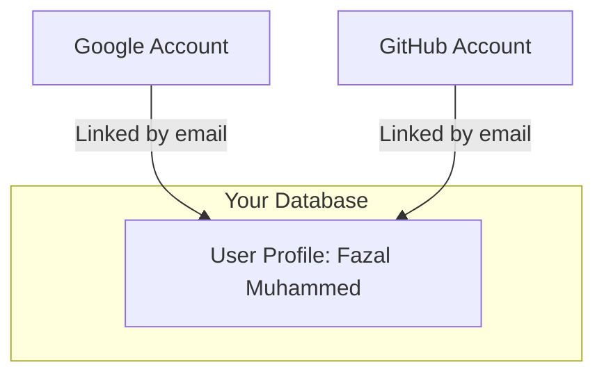

# Better Auth Study Notes

This document explains two key concepts in Better Auth: **Account Linking** and **User Info Overriding**.

---

## 1. Account Linking (`accountLinking`)

**What it is:** A feature that connects multiple authentication methods (GitHub, Google, Email, etc.) to a single **User Profile** in your database based on their email address.

### The Problem: Duplicate Accounts
Without account linking, if a user logs in with GitHub (`user@email.com`) and then later with Google (`user@email.com`), the system would create **two separate users**. This splits their data (comments, settings, etc.) across two profiles.

### The Solution: `enabled: true`
When account linking is enabled:
1.  **Email Check**: Better Auth checks if the email from the social provider already exists in the database.
2.  **Match Found**: If a match is found, it links the new social account to the **existing User record**.
3.  **Unified Experience**: The user has one profile regardless of how they choose to log in.

### Visual Flow


---

## 2. User Info Overriding (`overrideUserInfoOnSignIn`)

**What it is:** A configuration setting that determines if the user's profile information (Name and Image/DP) should be updated every time they log in.

### Why it's needed
By default, Better Auth typically only saves the user's name and image during their **initial signup**. On subsequent logins, it finds the existing user and logs them in, but doesn't change their stored profile data.

### How it works with `true`
When `overrideUserInfoOnSignIn: true` is set for a provider:
- **Fresh Data**: Every time the user signs in, Better Auth pulls the **latest** name and image from the social provider (GitHub or Google).
- **Database Update**: It automatically updates the User record in your database with this fresh data.
- **Result**: If you sign in with Google, you see your Google image. If you sign in with GitHub, you see your GitHub image.

---

## Implementation Example (`lib/auth.ts`)

```typescript
export const auth = betterAuth({
    socialProviders: {
        github: {
            clientId: process.env.GITHUB_CLIENT_ID!,
            clientSecret: process.env.GITHUB_CLIENT_SECRET!,
            // Updates profile info on every login
            overrideUserInfoOnSignIn: true, 
        },
        google: {
            clientId: process.env.GOOGLE_CLIENT_ID!,
            clientSecret: process.env.GOOGLE_CLIENT_SECRET!,
            overrideUserInfoOnSignIn: true,
        },
    },
    accountLinking: {
        // Connects accounts sharing the same email
        enabled: true, 
    }
});
```
