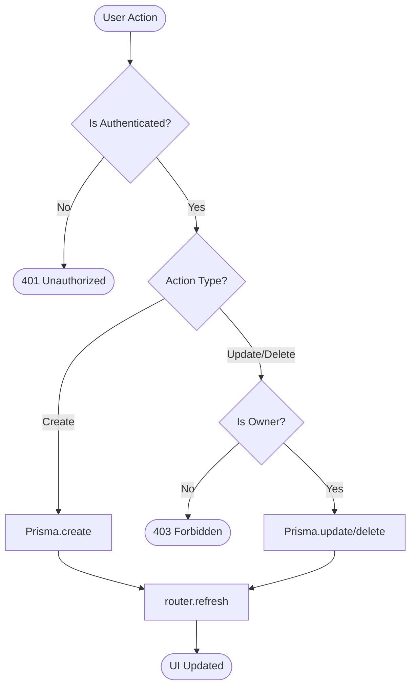
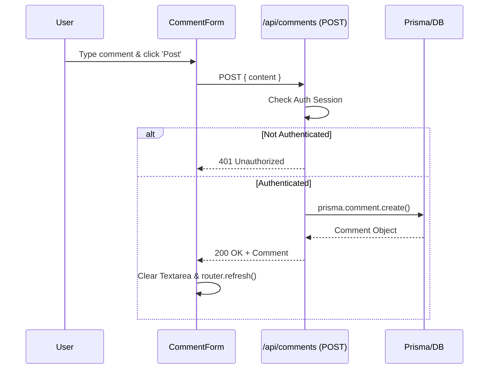
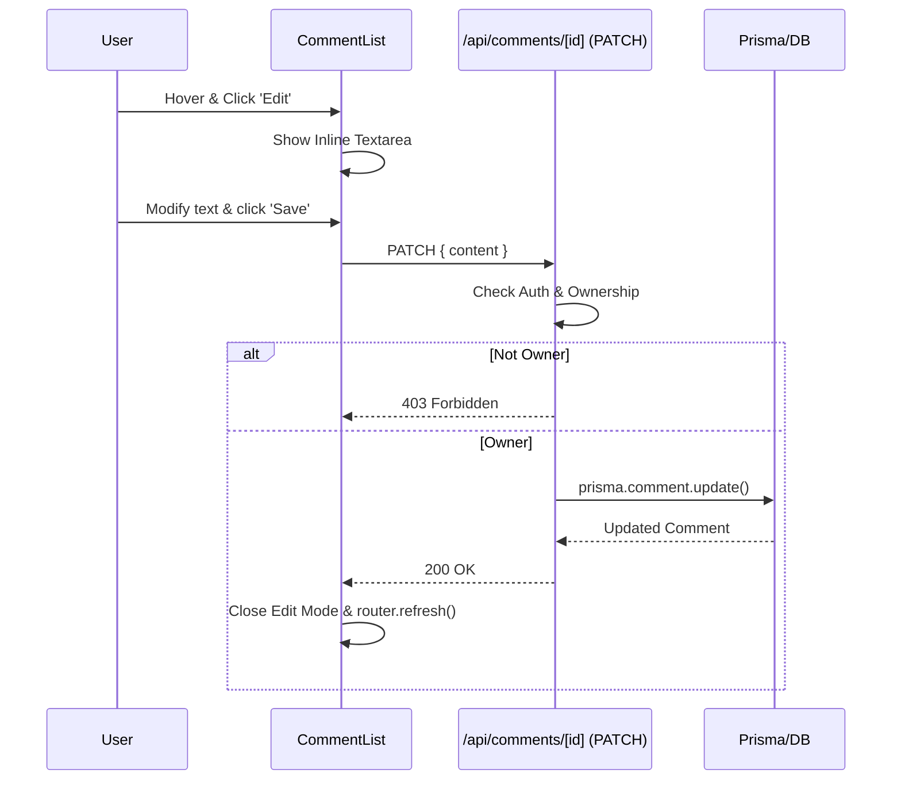
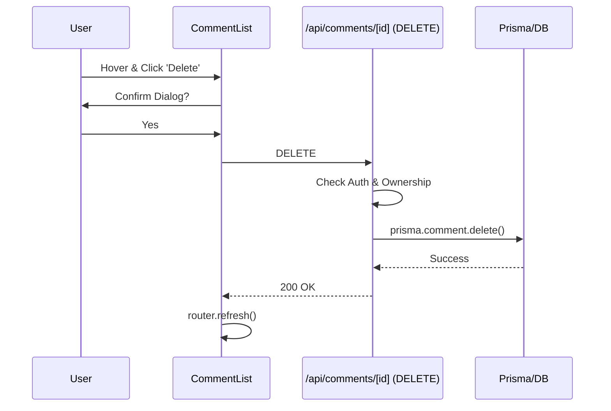

# Comment CRUD Implementation Documentation

This document explains the architecture and data flow for the Comment CRUD (Create, Read, Update, Delete) operations in the application.

## 🏗️ Architecture Overview

The system uses a standard Next.js App Router architecture with a Prisma/PostgreSQL backend and Better Auth for session management.

### Key Files
1.  **Schema**: [schema.prisma](file:///c:/Users/ebran/nextjsPrisma/nextjsPrisma/prisma/schema.prisma) - Defines the `Comment` model.
2.  **API (Create/List)**: [route.ts](file:///c:/Users/ebran/nextjsPrisma/nextjsPrisma/app/api/comments/route.ts) - Handles `POST` (Create).
3.  **API (Update/Delete)**: [route.ts](file:///c:/Users/ebran/nextjsPrisma/nextjsPrisma/app/api/comments/[id]/route.ts) - Handles `PATCH` (Update) and `DELETE` (Delete).
4.  **UI (Form)**: [comment-form.tsx](file:///c:/Users/ebran/nextjsPrisma/nextjsPrisma/components/comment-form.tsx) - Form for creating new comments.
5.  **UI (List/Edit/Delete)**: [comment-list.tsx](file:///c:/Users/ebran/nextjsPrisma/nextjsPrisma/components/comment-list.tsx) - Displays comments and handles inline editing/deletion.

---

## �️ System Flowchart

This flowchart shows the overall logic and decision-making process for mutations (Create/Update/Delete).

---

## �🔄 Logic Flows

### 1. Create Comment Flow

### 2. Update Comment Flow

### 3. Delete Comment Flow

---

## 🔒 Security & Verification
- **Authentication**: All mutation routes (`POST`, `PATCH`, `DELETE`) verify the user session using Better Auth.
- **Authorization**: For `Update` and `Delete`, the server checks if the `comment.userId` matches the `session.user.id`.
- **Validation**: Server-side checks ensure content is not empty and is a valid string.
- **Hydration**: Client-side UI uses `suppressHydrationWarning` for local-dependent dates to ensure a smooth SSR experience.
